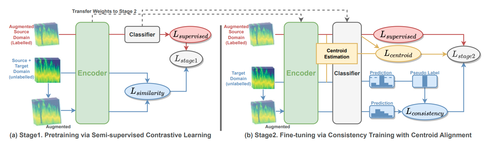

# GaitSADA
This repository contains the code for:
__GaitSADA: Self-Aligned Domain Adaptation for mmWave Gait Recognition__
The paper submitted to [IEEE MASS 2023](https://cis.temple.edu/ieeemass2023/index.html)

[](https://arxiv.org/abs/2301.13384) 


Please visit our [webpage](https://exitudio.github.io/GaitSADA) for more detail
## News
📢 [2023/09/25] Presentation at IEEE MASS 2023 (Toronto, Canada) in Session 1A: AI/ML based Smart Design 1 (9:55 - 11:05).  
📢 [2023/06/26] Paper accepted to IEEE MASS 2023.
## install
```
pip install tensorflow scikit-learn matplotlib sklearn h5py PyYAML numpy tqdm
```

Add ouput path
```
export MMWAVE_PATH=~/mmwave-data/exit/preprocessed/256_resized/
```

### Train

1. GaitSADA:
```
python3 GaitSADA.py  --train_src_days=3 --train_trg_days=3 --src_aug=1 --trgt_aug=1 --epochs=10000 --epochs_2stage=10000 --log_dir=logs/example/GaitSADA/ --notes=temperal_3_day --notes_2stage=v1
```

2. Supervised Learning
```
python3 models/supervised.py --train_src_days=3 --epochs=5000 --log_dir=logs/example/vanilla/
```

3. GAN
```
python3 GAN.py --train_src_days=3 --train_trg_days=3 --log_dir=logs/example/GAN
```

4. GRL
```
python3 GRL.py --train_src_days=3 --train_con_days=3 --log_dir=logs/example/GRL --note=GRL_vanilla
```

5. ADDA
```
python3 ADDA.py --train_src_days=3 --train_off_days=3 
```

6. CDAN
```
python3 CDAN.py --train_src_days=3 --train_trg_days=3 --log_dir=logs/example/CDAN
```

7. FixMatch
```
python3 FixMatch.py --train_src_days=3 --train_trg_days=3 --log_dir=logs/example/FixMatch
```

### Parameters
Number of days of source data can be specified by
```
--train_src_days=3
```

Number of days of target data can be specified by
```
--train_trg_days=3 
--train_ser_days=3
--train_con_days=3
--train_off_days=3
```
## Main Results
Result of training on 1 to 3 days on the data from laboratory location (source domain) while adapting to different 1 to 3 days data of same location (i.e., temporal target domain) and 1 to 3 days of different target locations, (i.e., server, conference, and office)


<!-- #### 1 Day Result

|   Methods        | Temporal | Server | Conference | Office | Average |
|:-----------------|:---------|:-------|:-----------|:-------|:--------|
| Supervised       |   76.05  |   34.93|  47.00     |   33.39| 47.84   |
| GAN              |79.57     |38.14   |66.00       |32.93   |54.16    |
| GRL              |74.97     |40.14   |62.10       |36.14   |53.34    |
| ADDA             |80.96     |37.71   | 65.21      |32.60   |54.12    |
| CDAN             |73.67     | 45.15  | 62.40      |43.24   |56.12    |
| FixMatch         |94.32     | 44.24  | 69.40      |49.05   |64.25    |
|**GaitSADA (our)**|96.3      | 75.98  | 82.6       |63.76   |79.66    | -->

<!-- #### 2 Day Result
|   Methods        | Temporal | Server | Conference | Office | Average |
|:-----------------|:---------|:-------|:-----------|:-------|:--------|
| Supervised       |   88.46  |   53.05|  71.00     |   49.92| 65.61   | -->


### Licence & Acknowledgement
GaitSADA itself is released under the MIT License.

---

https://ekkasit.com

## <a name="GaitSADA">Citing GaitSADA</a>
If you find our work useful in your research, please consider citing:

```
@article{pinyoanuntapong2023gaitsada,
      title={GaitSADA: Self-Aligned Domain Adaptation for mmWave Gait Recognition}, 
      author={Ekkasit Pinyoanuntapong and Ayman Ali and Kalvik Jakkala and Pu Wang and Minwoo Lee and Qucheng Peng and Chen Chen and Zhi Sun},
      year={2023},
      eprint={2301.13384},
      archivePrefix={arXiv},
      primaryClass={cs.CV}
}
```


<!-- python3 ResnetVanilla_FixMatch_centroid.py  --train_src_days=3 --train_trg_days=3 --src_aug=1 --trgt_aug=1 --epochs=10000 --epochs_fixmatch=10000 --log_dir=logs/Baselines/paper/vanilla_fixMatch_centroid_softlabel_self_supervsied/ --notes=temperal_3_day --notes_fixmatch=v1


python3 ResnetAMCA_DomClas_GAN_Vanilla.py --train_src_days=3 --train_trg_days=3 --log_dir=logs/Baselines/paper/GAN
python3 ResnetAMCA_DomClas_GRL_Vanilla.py --train_src_days=3 --train_con_days=3 --log_dir=logs/Baselines/paper/GRL --note=GRL_vanilla
python3 ResnetADDA.py --train_src_days=3 --train_off_days=3 

python3 ResnetCDAN_2.py --train_src_days=3 --train_trg_days=3 --log_dir=logs/Baselines/paper/CDAN

python3 ResnetFixMatch.py --train_src_days=3 --train_trg_days=3 --log_dir=logs/Baselines/paper/FixMatch -->
